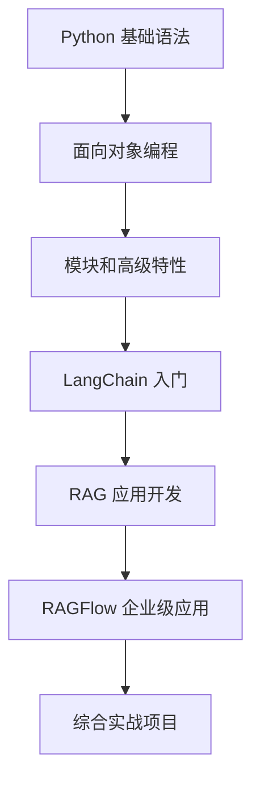

# Python 学习完整指南

> 🎯 这是一个从零基础到 LLM 应用开发的完整学习路径，包含所有学习资源、示例代码、练习项目和实战案例。

## 📋 目录

- [学习路径概览](#学习路径概览)
- [第一阶段：Python 基础](#第一阶段python-基础)
- [第二阶段：Python 进阶](#第二阶段python-进阶)
- [第三阶段：LLM 应用开发](#第三阶段llm-应用开发)
- [第四阶段：实战项目](#第四阶段实战项目)
- [学习资源索引](#学习资源索引)
- [快速参考](#快速参考)

---

## 🎯 学习路径概览



### 学习时间规划

| 阶段 | 预计时间 | 核心目标 |
|------|----------|----------|
| 第一阶段 | 2-3 周 | 掌握 Python 基础语法 |
| 第二阶段 | 2-3 周 | 理解 OOP 和高级特性 |
| 第三阶段 | 3-4 周 | 学会 LLM 应用开发 |
| 第四阶段 | 2-3 周 | 完成实战项目 |

---

## 📖 第一阶段：Python 基础

### 🎯 学习目标
掌握 Python 基本语法、数据类型、控制流程、函数等核心概念

### 📚 学习资源

#### 1. 快速入门
**文件**: [QUICKSTART.md](QUICKSTART.md)
- 项目介绍和快速开始
- 环境配置
- 运行第一个程序

#### 2. 基础语法示例
**目录**: [examples/basics/](examples/basics/)
- `hello_world.py` - 第一个程序
- `variables.py` - 变量和数据类型
- `control_flow.py` - 条件语句和循环

**学习顺序**:
```bash
# 1. 先看 hello_world.py 了解基本运行方式
python examples/basics/hello_world.py

# 2. 学习变量和数据类型
python examples/basics/variables.py

# 3. 掌握控制流
python examples/basics/control_flow.py
```

#### 3. 学习笔记
**文件**: [notes/python_basics.md](notes/python_basics.md)
- Python 基础概念总结
- 重要知识点梳理
- 常见问题解答

#### 4. 练习题
**文件**: [exercises/exercise1.py](exercises/exercise1.py)
- 基础练习题
- 巩固所学知识
- 提供参考答案

### ✅ 阶段目标检查清单

完成第一阶段后，你应该能够：
- [ ] 运行 Python 程序
- [ ] 理解变量和数据类型（int, float, str, bool, list, dict）
- [ ] 使用运算符（算术、比较、逻辑）
- [ ] 编写条件语句（if, elif, else）
- [ ] 使用循环（for, while）
- [ ] 定义和调用函数
- [ ] 处理基本输入输出

### 💡 实践建议

1. **边学边练**: 每学一个概念，立即运行示例代码
2. **动手修改**: 尝试修改示例代码，观察变化
3. **完成练习**: 认真完成所有练习题
4. **记录问题**: 遇到问题记录下来，查阅文档

---

## 📖 第二阶段：Python 进阶

### 🎯 学习目标
深入理解面向对象编程、模块系统、装饰器等高级特性

### 📚 学习资源

#### 1. 面向对象编程
**目录**: [examples/oop/](examples/oop/)
- `basic_class.py` - 类和对象、继承、封装

**学习步骤**:
```bash
# 1. 学习类和对象
python examples/oop/basic_class.py

# 阅读代码注释，理解：
# - 如何定义类
# - __init__ 方法的作用
# - 实例变量和类变量
# - 继承的实现
```

#### 2. 模块和包
**目录**: [examples/modules/](examples/modules/)
- `file_operations.py` - 文件操作、模块导入

**学习步骤**:
```bash
# 1. 学习模块使用
python examples/modules/file_operations.py

# 理解内容：
# - 如何导入模块
# - from...import 的用法
# - __name__ == '__main__' 的作用
# - 文件读写操作
```

#### 3. 高级特性
**目录**: [examples/advanced/](examples/advanced/)
- `decorators.py` - 装饰器、生成器、迭代器

**学习步骤**:
```bash
# 1. 学习装饰器
python examples/advanced/decorators.py

# 重点理解：
# - 装饰器的原理
# - @wraps 装饰器的作用
# - 生成器和 yield 关键字
# - 迭代器协议
```

### ✅ 阶段目标检查清单

完成第二阶段后，你应该能够：
- [ ] 定义类和创建对象
- [ ] 理解 self 参数的作用
- [ ] 实现类的继承
- [ ] 使用 super() 调用父类方法
- [ ] 理解封装（私有变量）
- [ ] 导入和使用模块
- [ ] 创建自己的模块
- [ ] 理解装饰器的语法
- [ ] 使用 @property 装饰器
- [ ] 理解生成器和迭代器

### 💡 实践建议

1. **动手实践**: 尝试创建自己的类
2. **阅读源码**: 分析示例代码的每个细节
3. **举一反三**: 尝试用不同方式实现相同功能
4. **理解原理**: 不要只停留在语法层面，理解背后的原理

---

## 📖 第三阶段：LLM 应用开发

### 🎯 学习目标
掌握 LangChain 和 RAGFlow，能够开发智能问答和文档处理应用

### 📚 学习资源

#### 1. 快速上手
**文件**: [RAGFLOW_LANGCHAIN_QUICKSTART.md](RAGFLOW_LANGCHAIN_QUICKSTART.md)
- 环境配置
- 依赖安装
- 快速运行示例

#### 2. LangChain 基础
**文件**: [examples/llm/langchain-basics.py](examples/llm/langchain-basics.py)

**学习内容**:
```bash
# 1. 安装依赖
pip install langchain langchain-openai langchain-community

# 2. 设置 API 密钥
export OPENAI_API_KEY="your-api-key"

# 3. 运行示例
python examples/llm/langchain-basics.py

# 学习内容：
# - LLM 调用
# - Prompt Template
# - LLMChain
# - 对话记忆
```

**重点概念**:
- `ChatOpenAI` - 大语言模型接口
- `PromptTemplate` - 提示词模板
- `LLMChain` - 链式调用
- `ConversationBufferMemory` - 对话记忆

#### 3. RAG 应用开发
**文件**: [examples/llm/langchain-rag-examples.py](examples/llm/langchain-rag-examples.py)

**学习内容**:
```bash
# 1. 安装向量数据库
pip install chromadb

# 2. 运行 RAG 示例
python examples/llm/langchain-rag-examples.py

# 学习内容：
# - 向量数据库（Chroma）
# - 文档分块（RecursiveCharacterTextSplitter）
# - 嵌入向量（OpenAIEmbeddings）
# - 检索增强生成（RetrievalQA）
```

**重点概念**:
- `Chroma` - 向量数据库
- `Embeddings` - 文本向量化
- `Document Loaders` - 文档加载器
- `Text Splitters` - 文本分割器
- `RetrievalQA` - 检索问答链

#### 4. RAGFlow 企业级应用
**文件**: [examples/llm/ragflow-integration.py](examples/llm/ragflow-integration.py)

**学习内容**:
```bash
# 1. 部署 RAGFlow（Docker）
docker run -d -p 9380:9380 ragflow/ragflow

# 2. 运行示例
python examples/llm/ragflow-integration.py

# 学习内容：
# - RAGFlow API 客户端
# - 知识库管理
# - 批量文档处理
# - 多轮对话
```

**重点概念**:
- `RAGFlowClient` - API 客户端
- 数据集管理
- 文档解析
- 聊天会话

#### 5. 深度学习指南
**目录**: [.agentdocs/learning/](.agentdocs/learning/)
- `ragflow-langchain-guide.md` - 核心概念和学习路径
- `comprehensive-guide.md` - 5阶段详细指南、最佳实践、FAQ

### ✅ 阶段目标检查清单

完成第三阶段后，你应该能够：
- [ ] 调用 OpenAI API
- [ ] 使用 Prompt Template 构建提示词
- [ ] 使用 LLMChain 组合多个步骤
- [ ] 配置向量数据库（Chroma）
- [ ] 实现文档检索和问答
- [ ] 理解 RAG（检索增强生成）原理
- [ ] 部署 RAGFlow 服务器
- [ ] 通过 API 管理知识库
- [ ] 构建多轮对话系统
- [ ] 优化检索效果和成本控制

### 💡 实践建议

1. **API 密钥**: 确保你有 OpenAI API 密钥
2. **环境准备**: 使用虚拟环境隔离依赖
3. **循序渐进**: 从简单示例开始，逐步增加复杂度
4. **理解原理**: 不要只是调用 API，理解底层原理
5. **实践项目**: 完成实战项目巩固知识

---

## 📖 第四阶段：实战项目

### 🎯 学习目标
完成一个完整的生产级应用，整合所有学到的知识

### 📚 学习资源

#### 文档问答系统
**目录**: [projects/document-qa-system/](projects/document-qa-system/)

**项目特性**:
- 支持多种文档格式（PDF、TXT、DOCX）
- 智能文本分块
- 向量化存储和检索
- 多轮对话
- 答案溯源

**学习步骤**:

```bash
# 1. 进入项目目录
cd projects/document-qa-system

# 2. 安装依赖
pip install -r requirements.txt

# 3. 设置环境变量
export OPENAI_API_KEY="your-api-key"

# 4. 准备知识库（已有示例文档）
ls data/knowledge/

# 5. 运行系统
python main.py

# 6. 测试问答
# 输入问题，查看答案和来源
```

**项目结构**:
```
document-qa-system/
├── main.py              # 主程序入口
├── README.md            # 详细文档
├── requirements.txt     # 依赖列表
└── data/
    └── knowledge/       # 知识库文档
        ├── python-guide.txt  # Python 教程
        └── ml-basics.txt     # 机器学习基础
```

**核心代码解析**:

`main.py` 主要类：
- `Config` - 配置管理
- `DocumentProcessor` - 文档处理器
- `VectorStoreManager` - 向量存储管理
- `DocumentQASystem` - 问答系统

**扩展建议**:
1. 添加更多文档格式支持
2. 实现 Web 界面（Flask/FastAPI）
3. 添加用户认证
4. 优化检索算法
5. 实现实时更新知识库

### ✅ 阶段目标检查清单

完成第四阶段后，你应该能够：
- [ ] 理解完整的 RAG 应用架构
- [ ] 处理多种文档格式
- [ ] 实现智能检索和问答
- [ ] 构建可扩展的系统
- [ ] 优化性能和用户体验
- [ ] 部署生产级应用

---

## 📚 学习资源索引

### 基础学习
| 文件/目录 | 类型 | 描述 | 优先级 |
|-----------|------|------|--------|
| [QUICKSTART.md](QUICKSTART.md) | 文档 | 项目快速开始指南 | ⭐⭐⭐ |
| [examples/basics/](examples/basics/) | 代码 | Python 基础语法示例 | ⭐⭐⭐ |
| [notes/python_basics.md](notes/python_basics.md) | 文档 | Python 基础学习笔记 | ⭐⭐ |
| [exercises/exercise1.py](exercises/exercise1.py) | 代码 | 基础练习题 | ⭐⭐ |

### 进阶学习
| 文件/目录 | 类型 | 描述 | 优先级 |
|-----------|------|------|--------|
| [examples/oop/](examples/oop/) | 代码 | 面向对象编程示例 | ⭐⭐⭐ |
| [examples/modules/](examples/modules/) | 代码 | 模块和文件操作示例 | ⭐⭐⭐ |
| [examples/advanced/](examples/advanced/) | 代码 | 高级特性示例（装饰器等） | ⭐⭐ |

### LLM 应用开发
| 文件/目录 | 类型 | 描述 | 优先级 |
|-----------|------|------|--------|
| [RAGFLOW_LANGCHAIN_QUICKSTART.md](RAGFLOW_LANGCHAIN_QUICKSTART.md) | 文档 | LLM 应用开发快速开始 | ⭐⭐⭐ |
| [examples/llm/langchain-basics.py](examples/llm/langchain-basics.py) | 代码 | LangChain 基础示例 | ⭐⭐⭐ |
| [examples/llm/langchain-rag-examples.py](examples/llm/langchain-rag-examples.py) | 代码 | RAG 应用开发示例 | ⭐⭐⭐ |
| [examples/llm/ragflow-integration.py](examples/llm/ragflow-integration.py) | 代码 | RAGFlow 集成示例 | ⭐⭐ |
| [.agentdocs/learning/ragflow-langchain-guide.md](.agentdocs/learning/ragflow-langchain-guide.md) | 文档 | RAGFlow/LangChain 基础指南 | ⭐⭐⭐ |
| [.agentdocs/learning/comprehensive-guide.md](.agentdocs/learning/comprehensive-guide.md) | 文档 | 完整学习指南（含最佳实践） | ⭐⭐⭐ |

### 实战项目
| 文件/目录 | 类型 | 描述 | 优先级 |
|-----------|------|------|--------|
| [projects/document-qa-system/](projects/document-qa-system/) | 项目 | 文档问答系统实战项目 | ⭐⭐⭐ |

---

## 🚀 快速参考

### 环境配置

```bash
# 1. 创建虚拟环境
python -m venv venv
source venv/bin/activate  # Linux/macOS
# venv\Scripts\activate   # Windows

# 2. 安装依赖
pip install -r requirements.txt

# 3. 设置 API 密钥
export OPENAI_API_KEY="your-api-key"
```

### 常用命令

```bash
# 运行基础示例
python examples/basics/hello_world.py
python examples/basics/variables.py
python examples/basics/control_flow.py

# 运行进阶示例
python examples/oop/basic_class.py
python examples/modules/file_operations.py
python examples/advanced/decorators.py

# 运行 LLM 示例
python examples/llm/langchain-basics.py
python examples/llm/langchain-rag-examples.py

# 运行实战项目
cd projects/document-qa-system
python main.py
```

### 学习检查清单

#### 基础阶段 ☐
- [ ] 完成所有基础示例
- [ ] 完成练习题
- [ ] 能够独立编写简单程序
- [ ] 理解函数和递归

#### 进阶阶段 ☐
- [ ] 掌握面向对象编程
- [ ] 理解装饰器原理
- [ ] 熟练使用模块和包
- [ ] 能够阅读和理解复杂代码

#### LLM 应用开发 ☐
- [ ] 完成所有 LangChain 示例
- [ ] 理解 RAG 原理
- [ ] 能够构建简单的问答系统
- [ ] 掌握向量数据库使用

#### 实战项目 ☐
- [ ] 成功运行文档问答系统
- [ ] 添加自己的文档
- [ ] 理解系统架构
- [ ] 能够扩展功能

### 故障排除

#### 常见错误

**1. 导入错误**
```bash
# 错误：ModuleNotFoundError
# 解决：确保在项目根目录运行
cd /Users/kwok/project/python/test1
python examples/basics/hello_world.py
```

**2. API 密钥错误**
```bash
# 错误：OpenAI API 错误
# 解决：检查环境变量
echo $OPENAI_API_KEY
# 或在 .env 文件中设置
```

**3. 依赖缺失**
```bash
# 错误：ModuleNotFoundError: No module named 'langchain'
# 解决：安装依赖
pip install -r requirements.txt
```

**4. 文档加载失败**
```bash
# 错误：FileNotFoundError
# 解决：检查文件路径
ls projects/document-qa-system/data/knowledge/
```

### 学习建议

1. **循序渐进**: 按阶段学习，不要跳跃
2. **动手实践**: 每学一个概念，立即编码验证
3. **反复练习**: 重要概念要多练习几次
4. **查阅文档**: 遇到问题先查官方文档
5. **记录总结**: 建立学习笔记和代码库
6. **寻求帮助**: 遇到困难及时求助社区

### 下一步发展

完成本项目学习后，可以继续深入：

1. **深度学习**: PyTorch、TensorFlow
2. **Web 开发**: Django、Flask、FastAPI
3. **数据科学**: Pandas、NumPy、Matplotlib
4. **机器学习**: Scikit-learn、XGBoost
5. **Agent 开发**: LangChain Agents、AutoGPT
6. **多模态 AI**: CLIP、DALL-E、GPT-4V
7. **本地部署**: Llama、Mistral、Ollama

---

## 📞 获取帮助

### 学习资源
- [Python 官方文档](https://docs.python.org/3/)
- [LangChain 官方文档](https://python.langchain.com/)
- [RAGFlow 官方文档](https://ragflow.io/)

### 社区支持
- Stack Overflow
- Reddit r/Python
- LangChain Discord
- GitHub Issues

### 项目文件
- 完整代码: 本项目所有文件
- 学习笔记: `notes/` 目录
- 学习指南: `.agentdocs/learning/` 目录

---

## 🎉 结语

恭喜你完成了完整的学习路径！通过这个项目，你将：

✅ 掌握 Python 基础到高级的所有核心概念
✅ 理解面向对象编程和函数式编程
✅ 学会使用 LangChain 开发 LLM 应用
✅ 掌握 RAGFlow 企业级部署
✅ 完成一个完整的实战项目

记住：**编程是一门实践的艺术**。只有通过不断的编码、调试、改进，才能真正掌握这些技能。

祝你学习愉快！🚀

---

*最后更新: 2025-12-17*
