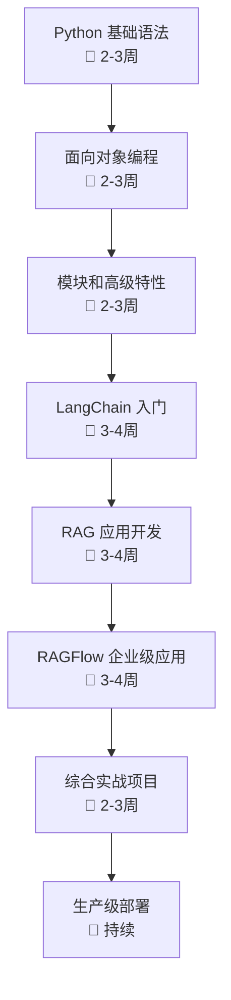

# Python 学习项目 - 从基础到 LLM 应用开发

> 🎯 这是一个从 Python 零基础到 LLM 应用开发的完整学习项目，包含系统化的学习路径、丰富的示例代码和实战项目。

[](https://www.python.org/downloads/)
[](LICENSE)
[](https://python.langchain.com/)

## ✨ 项目亮点

- 📚 **完整学习体系** - 从 Python 基础到 LLM 应用的系统化学习路径
- 💻 **丰富的示例** - 涵盖基础语法、面向对象、高级特性到 LLM 应用开发
- 🚀 **实战项目** - 文档问答系统，可直接部署使用
- 📖 **详细文档** - 完整的学习指南、最佳实践和常见问题解答
- 🎯 **阶段化学习** - 四个阶段循序渐进，零基础也能轻松上手

## 🎯 学习路径

```
🌱 Python 基础 (2-3周)
   ↓
🌿 Python 进阶 (2-3周)
   ↓
🌳 LLM 应用开发 (3-4周)
   ↓
🎯 实战项目 (2-3周)
```

## 📁 项目结构

```
test1/
├── 📄 README.md                           # 项目说明（本文件）
├── 📄 COMPLETE_LEARNING_GUIDE.md         # 完整学习指南
├── 📄 LEARNING_INDEX.md                  # 学习资源导航
├── 📄 RAGFLOW_LANGCHAIN_QUICKSTART.md    # LLM开发快速开始
├── 📄 QUICKSTART.md                       # 快速开始指南
├── 📄 文档导航.md                         # 中文学习导航
│
├── 📂 examples/                           # 📚 示例代码
│   ├── basics/                           # 基础语法
│   │   ├── hello_world.py                # 第一个程序
│   │   ├── variables.py                  # 变量和数据类型
│   │   └── control_flow.py               # 条件语句和循环
│   ├── oop/                              # 面向对象编程
│   │   └── basic_class.py                # 类和对象
│   ├── modules/                          # 模块和包
│   │   └── file_operations.py            # 文件操作
│   ├── advanced/                         # 高级特性
│   │   └── decorators.py                 # 装饰器、生成器
│   └── llm/                              # LLM 应用开发
│       ├── langchain-basics.py           # LangChain 基础
│       ├── langchain-rag-examples.py     # RAG 应用开发
│       └── ragflow-integration.py        # RAGFlow 集成
│
├── 📂 projects/                           # 🚀 实战项目
│   ├── document-qa-system/               # 文档问答系统（LLM应用）
│   │   ├── main.py                       # 主程序
│   │   ├── README.md                     # 项目文档
│   │   ├── requirements.txt              # 依赖列表
│   │   └── data/knowledge/               # 示例知识库
│   │       ├── python-guide.txt          # Python 教程
│   │       └── ml-basics.txt             # 机器学习基础
│   │
│   ├── data-science/                     # 📊 数据科学
│   │   └── pandas-guide/                 # Pandas 数据分析指南
│   │       ├── 01_data_loading.py        # 数据加载
│   │       ├── 02_data_cleaning.py       # 数据清洗
│   │       ├── 03_data_analysis.py       # 数据分析
│   │       ├── 04_data_visualization.py  # 数据可视化
│   │       ├── README.md                 # 项目文档
│   │       └── requirements.txt          # 依赖列表
│   │
│   ├── web-development/                  # 🌐 Web 开发
│   │   └── fastapi-rest-api/             # FastAPI REST API
│   │       ├── app/                      # 应用代码
│   │       │   ├── main.py               # FastAPI 应用
│   │       │   ├── core/                 # 核心配置
│   │       │   ├── api/                  # API 路由
│   │       │   ├── models/               # 数据模型
│   │       │   ├── services/             # 业务逻辑
│   │       │   └── schemas/              # Pydantic 模式
│   │       ├── test_api.py               # API 测试
│   │       ├── README.md                 # 项目文档
│   │       └── requirements.txt          # 依赖列表
│   │
│   └── automation/                       # 🤖 自动化
│       └── web-scraping/                 # 网络爬虫
│           ├── 01_basic_scraper.py       # 基础爬虫
│           ├── 02_advanced_scraper.py    # 高级爬虫
│           ├── README.md                 # 项目文档
│           └── requirements.txt          # 依赖列表
│
├── 📂 exercises/                          # 💻 练习题
│   └── exercise1.py                      # 基础练习
│
├── 📂 notes/                              # 📝 学习笔记
│   └── python_basics.md                  # Python 基础笔记
│
├── 📂 .agentdocs/                         # 📚 学习指南
│   ├── index.md                          # 文档索引
│   └── learning/                         # 深度学习指南
│       ├── ragflow-langchain-guide.md    # RAGFlow/LangChain 指南
│       └── comprehensive-guide.md        # 完整学习指南
│
└── 📂 data/                               # 📊 示例数据
```

## 🚀 快速开始

### 第一步：了解项目

推荐阅读顺序：

1. **[COMPLETE_LEARNING_GUIDE.md](COMPLETE_LEARNING_GUIDE.md)** - 完整学习指南（⭐⭐⭐ 强烈推荐）
2. **[LEARNING_INDEX.md](LEARNING_INDEX.md)** - 学习资源导航
3. **[QUICKSTART.md](QUICKSTART.md)** - 快速开始指南

### 第二步：环境准备

```bash
# 1. 克隆项目
git clone <your-repo-url>
cd test1

# 2. 创建虚拟环境
python -m venv venv

# 3. 激活虚拟环境
# Windows
venv\Scripts\activate
# macOS/Linux
source venv/bin/activate

# 4. 安装基础依赖
pip install -r requirements.txt
```

### 第三步：开始学习

#### 🌱 零基础学习者

```bash
# 1. 学习 Python 基础
python examples/basics/hello_world.py
python examples/basics/variables.py
python examples/basics/control_flow.py

# 2. 完成练习题
python exercises/exercise1.py

# 3. 学习进阶内容
python examples/oop/basic_class.py
python examples/modules/file_operations.py
python examples/advanced/decorators.py
```

#### 🌳 已有 Python 基础的学习者

```bash
# 选择一个方向深入学习：

# 📊 方向 1: 数据科学
pip install -r requirements.txt  # 安装所有必需依赖
cd projects/data-science/pandas-guide
python 01_data_loading.py
python 02_data_cleaning.py
python 03_data_analysis.py
python 04_data_visualization.py

# 🌐 方向 2: Web 开发
pip install fastapi uvicorn
cd ../../web-development/fastapi-rest-api
python -m uvicorn app.main:app --reload
# 访问 http://localhost:8000/docs 查看 API 文档

# 🤖 方向 3: 网络爬虫
pip install -r requirements.txt  # 安装所有必需依赖（包括异步爬虫支持）
cd ../../automation/web-scraping
python 01_basic_scraper.py
python 02_advanced_scraper.py

# 🧠 方向 4: LLM 应用开发
pip install langchain langchain-openai langchain-community chromadb
export OPENAI_API_KEY="your-api-key"
cd ../../examples/llm
python langchain-basics.py
python langchain-rag-examples.py

# 🎯 完成综合实战项目
cd ../../projects/document-qa-system
python main.py
```

## 📚 学习内容

### 第一阶段：Python 基础（2-3周）

#### 核心概念
- ✅ 变量和数据类型（int, float, str, bool, list, dict）
- ✅ 运算符（算术、比较、逻辑）
- ✅ 控制流（if/elif/else, for, while）
- ✅ 函数定义和调用
- ✅ 文件 I/O 操作

#### 学习资源
- 📝 `examples/basics/` - 基础语法示例
- 📝 `notes/python_basics.md` - 学习笔记
- 💻 `exercises/exercise1.py` - 练习题

### 第二阶段：Python 进阶（2-3周）

#### 核心概念
- ✅ 面向对象编程（类、对象、继承、封装）
- ✅ 模块和包系统
- ✅ 装饰器（@decorator）
- ✅ 生成器和迭代器
- ✅ 上下文管理器
- ✅ 异步编程基础

#### 学习资源
- 📝 `examples/oop/basic_class.py` - 面向对象示例
- 📝 `examples/modules/file_operations.py` - 模块和文件操作
- 📝 `examples/advanced/decorators.py` - 高级特性

### 第三阶段：LLM 应用开发（3-4周）

#### 核心概念
- ✅ LangChain 框架（LLM、Prompt、Chain、Memory）
- ✅ 提示词工程（Prompt Engineering）
- ✅ RAG（检索增强生成）
- ✅ 向量数据库（Chroma、FAISS）
- ✅ 文档处理和分块策略
- ✅ RAGFlow 企业级部署

#### 学习资源
- 📝 `RAGFLOW_LANGCHAIN_QUICKSTART.md` - LLM开发快速开始
- 📝 `examples/llm/langchain-basics.py` - LangChain 基础
- 📝 `examples/llm/langchain-rag-examples.py` - RAG应用开发
- 📝 `examples/llm/ragflow-integration.py` - RAGFlow集成
- 📝 `.agentdocs/learning/comprehensive-guide.md` - 深度指南

### 第四阶段：实战项目（2-3周）

#### 项目 1: 文档问答系统（LLM 应用）

**功能特性：**
- 📄 支持多种文档格式（PDF、TXT、DOCX）
- 🔍 智能文本分块和向量化存储
- 💬 多轮对话和上下文记忆
- 📚 答案溯源（显示来源文档）
- ⚙️ 灵活的配置选项

**学习价值：**
- 🏗️ 完整的企业级应用架构
- 🔧 RAG 系统核心组件实践
- 📊 性能优化和成本控制
- 🚀 生产环境部署经验

#### 项目资源
- 📁 `projects/document-qa-system/` - 完整项目代码
- 📝 `projects/document-qa-system/README.md` - 详细文档

### 第五阶段：专业方向实战（3-4周）

#### 项目 2: 数据科学分析（数据科学方向）

**学习内容：**
- 📊 数据加载（CSV、Excel、JSON）
- 🧹 数据清洗（缺失值、重复值、异常值）
- 📈 数据分析（统计、分组、聚合）
- 📉 数据可视化（Matplotlib、Seaborn）

**实战价值：**
- 💼 掌握数据科学工作流
- 📊 学会商业数据分析
- 🎨 创建专业数据图表
- 🔍 挖掘数据价值

#### 项目资源
- 📁 `projects/data-science/pandas-guide/` - 完整学习项目
- 📝 `README.md` - 详细教程
- 📝 `01_data_loading.py` - 数据加载
- 📝 `02_data_cleaning.py` - 数据清洗
- 📝 `03_data_analysis.py` - 数据分析
- 📝 `04_data_visualization.py` - 数据可视化

#### 项目 3: REST API 服务（Web 开发方向）

**学习内容：**
- 🚀 FastAPI 框架使用
- 🔌 RESTful API 设计
- ✅ 数据验证（Pydantic）
- 📚 自动 API 文档
- 🧪 API 测试

**实战价值：**
- 🌐 构建 Web API 服务
- 💻 学习微服务架构
- 🔐 掌握 API 安全
- 📖 生成专业 API 文档

#### 项目资源
- 📁 `projects/web-development/fastapi-rest-api/` - 完整项目
- 📝 `README.md` - 详细教程
- 📝 `test_api.py` - API 测试脚本

#### 项目 4: 网络爬虫系统（自动化方向）

**学习内容：**
- 🕷️ 基础网页爬取（requests + BeautifulSoup）
- 🔧 高级爬虫技术（Scrapy、Selenium）
- ⚡ 异步爬虫（aiohttp）
- 🛡️ 反反爬策略
- 💾 数据存储和处理

**实战价值：**
- 🤖 自动化数据收集
- 📊 构建数据采集系统
- 🔍 网络数据挖掘
- 💼 商业情报收集

#### 项目资源
- 📁 `projects/automation/web-scraping/` - 完整项目
- 📝 `README.md` - 详细教程
- 📝 `01_basic_scraper.py` - 基础爬虫
- 📝 `02_advanced_scraper.py` - 高级爬虫

## 📖 详细学习指南

### 🎯 新手入门
- 📖 [COMPLETE_LEARNING_GUIDE.md](COMPLETE_LEARNING_GUIDE.md) - 完整学习路径（15,000字详细指南）
- 📖 [QUICKSTART.md](QUICKSTART.md) - 项目快速开始
- 📖 [RAGFLOW_LANGCHAIN_QUICKSTART.md](RAGFLOW_LANGCHAIN_QUICKSTART.md) - LLM开发快速开始

### 🔍 资源导航
- 📖 [LEARNING_INDEX.md](LEARNING_INDEX.md) - 学习资源导航（按阶段分类）
- 📖 [文档导航.md](文档导航.md) - 中文学习导航

### 📚 深度指南
- 📖 [`.agentdocs/learning/comprehensive-guide.md`](.agentdocs/learning/comprehensive-guide.md) - 完整学习指南（含最佳实践、FAQ）
- 📖 [`.agentdocs/learning/ragflow-langchain-guide.md`](.agentdocs/learning/ragflow-langchain-guide.md) - RAGFlow/LangChain 核心概念

### 💻 代码示例
- 📂 `examples/basics/` - Python 基础示例
- 📂 `examples/oop/` - 面向对象示例
- 📂 `examples/advanced/` - 高级特性示例
- 📂 `examples/llm/` - LLM 应用开发示例

### 🚀 实战项目
- 📂 `projects/document-qa-system/` - 文档问答系统

## ⚡ 常用命令

```bash
# ==================== Python 基础示例 ====================
# 运行基础示例
python examples/basics/hello_world.py
python examples/basics/variables.py
python examples/basics/control_flow.py

# 运行进阶示例
python examples/oop/basic_class.py
python examples/modules/file_operations.py
python examples/advanced/decorators.py

# ==================== LLM 应用开发 ====================
# 运行 LLM 示例
python examples/llm/langchain-basics.py
python examples/llm/langchain-rag-examples.py
python examples/llm/ragflow-integration.py

# ==================== 数据科学项目 ====================
# 数据科学项目
cd projects/data-science/pandas-guide
python 01_data_loading.py      # 数据加载
python 02_data_cleaning.py     # 数据清洗
python 03_data_analysis.py     # 数据分析
python 04_data_visualization.py # 数据可视化

# ==================== Web 开发项目 ====================
# FastAPI 项目
cd ../../web-development/fastapi-rest-api
python -m uvicorn app.main:app --reload --host 0.0.0.0 --port 8000
# 访问 http://localhost:8000/docs 查看 API 文档

# 测试 API
python test_api.py

# ==================== 网络爬虫项目 ====================
# 网络爬虫
cd ../../automation/web-scraping
python 01_basic_scraper.py     # 基础爬虫
python 02_advanced_scraper.py  # 高级爬虫

# ==================== LLM 实战项目 ====================
# 文档问答系统
cd ../../projects/document-qa-system
python main.py

# ==================== 练习题 ====================
# 运行练习题
cd ../../
python exercises/exercise1.py
```

## 🛠️ 技术栈

### Python 生态系统
- **基础语法**: 变量、数据类型、控制流、函数
- **面向对象**: 类、继承、多态、封装
- **高级特性**: 装饰器、生成器、迭代器、异步编程

### 📊 数据科学
- **Pandas**: 数据处理和分析
- **NumPy**: 数值计算
- **Matplotlib**: 基础绘图
- **Seaborn**: 统计数据可视化
- **SciPy**: 科学计算和统计分析

### 🌐 Web 开发
- **FastAPI**: 现代化 Web 框架
- **Uvicorn**: ASGI 服务器
- **Pydantic**: 数据验证和序列化
- **RESTful API**: 最佳实践和设计原则

### 🤖 自动化与爬虫
- **Requests**: HTTP 请求库
- **BeautifulSoup**: HTML 解析
- **Scrapy**: 专业爬虫框架
- **Selenium**: 浏览器自动化
- **aiohttp**: 异步 HTTP 客户端

### 🧠 LLM 应用开发
- **LangChain 框架**: 核心组件、Chains、Memory、RetrievalQA
- **RAGFlow 引擎**: 部署、API 集成、知识库管理
- **向量数据库**: Chroma、FAISS、嵌入模型
- **提示词工程**: 模板设计、Few-shot、Chain-of-Thought
- **实战项目**: 文档问答系统

## 📊 学习检查清单

### 基础阶段 ✅
- [ ] 运行所有基础示例
- [ ] 完成练习题
- [ ] 理解变量、数据类型、控制流
- [ ] 能够编写简单函数

### 进阶阶段 ✅
- [ ] 理解类和对象
- [ ] 掌握继承和封装
- [ ] 理解装饰器原理
- [ ] 熟练使用模块

### LLM 应用开发阶段 ✅
- [ ] 完成所有 LangChain 示例
- [ ] 理解 RAG 原理
- [ ] 能够调用 OpenAI API
- [ ] 构建简单的问答系统

### 数据科学阶段
- [ ] 完成所有 Pandas 示例
- [ ] 掌握数据加载和清洗
- [ ] 学会数据分析和可视化
- [ ] 能够独立完成数据分析项目

### Web 开发阶段
- [ ] 理解 RESTful API 设计
- [ ] 能够构建 FastAPI 应用
- [ ] 掌握数据验证和错误处理
- [ ] 完成 API 文档编写

### 自动化阶段
- [ ] 掌握基础爬虫技术
- [ ] 理解反反爬策略
- [ ] 能够处理动态网页
- [ ] 构建数据采集系统

### 综合实战阶段
- [ ] 成功运行文档问答系统
- [ ] 完成至少一个专业方向项目（数据科学/Web/爬虫）
- [ ] 添加自己的文档/数据
- [ ] 理解系统架构
- [ ] 能够扩展功能

## 🤝 贡献

我们欢迎所有形式的贡献！

### 如何贡献
1. Fork 本项目
2. 创建特性分支 (`git checkout -b feature/AmazingFeature`)
3. 提交更改 (`git commit -m 'Add some AmazingFeature'`)
4. 推送到分支 (`git push origin feature/AmazingFeature`)
5. 创建 Pull Request

### 贡献方向
- 🐛 修复 Bug
- ✨ 添加新的学习示例
- 📚 完善文档
- 💡 提出改进建议
- 🎯 添加新的实战项目

## 📞 获取帮助

### 官方文档
- [Python 官方文档](https://docs.python.org/3/)
- [LangChain 官方文档](https://python.langchain.com/)
- [RAGFlow 官方文档](https://ragflow.io/)

### 项目文档
- 📖 [COMPLETE_LEARNING_GUIDE.md](COMPLETE_LEARNING_GUIDE.md) - 完整学习指南
- 📚 [`.agentdocs/learning/comprehensive-guide.md`](.agentdocs/learning/comprehensive-guide.md) - 深度指南
- 📝 [项目 README](README.md) - 本文件

### 社区支持
- 💬 提交 Issue 讨论问题
- 🔍 搜索已有 Issue
- 📧 邮件联系维护者

## 📈 学习路径图

### 可视化路径（需要支持 Mermaid 的浏览器查看）



### 文本版本学习路径

```
第一阶段：Python 基础（2-3周）
   ↓
第二阶段：Python 进阶（2-3周）
   ↓
第三阶段：LLM 应用开发（3-4周）
   ↓
第四阶段：实战项目（2-3周）
   ↓
生产级部署（持续优化）
```

### 详细学习路径说明

1. **Python 基础** → 掌握变量、数据类型、控制流、函数
2. **Python 进阶** → 理解面向对象、模块系统、高级特性
3. **LLM 应用开发** → 学习 LangChain、RAG、RAGFlow
4. **实战项目** → 完成文档问答系统
5. **生产级部署** → 优化性能、扩展功能、企业应用

## 📝 更新日志

### v2.0.0 (2025-12-17)
- ✨ 新增完整的 LLM 应用开发学习体系
- ✨ 新增 LangChain 和 RAGFlow 实战内容
- ✨ 新增文档问答系统实战项目
- ✨ 新增详细的学习指南和最佳实践
- 📚 完善文档结构和学习资源导航

### v1.0.0
- 🎉 项目初始版本
- ✨ 基础 Python 学习示例
- ✨ 面向对象编程示例
- ✨ 高级特性示例

## 📜 许可证

本项目采用 MIT 许可证 - 查看 [LICENSE](LICENSE) 文件了解详情。

## 👨‍💻 作者

- **Claude** - *初始开发* - [Anthropic](https://www.anthropic.com)

## 🙏 致谢

- [Python 社区](https://www.python.org/) - 强大的编程语言
- [LangChain 团队](https://python.langchain.com/) - 出色的 LLM 应用开发框架
- [RAGFlow 团队](https://ragflow.io/) - 企业级 RAG 引擎
- 所有贡献者和学习者的支持！

## ⭐ 如果这个项目对你有帮助，请给我们一个 Star！

---

<div align="center">

**🚀 开始你的 Python 到 LLM 应用开发之旅吧！**

[📖 学习指南](COMPLETE_LEARNING_GUIDE.md) • [💻 运行示例](examples/) • [🚀 实战项目](projects/document-qa-system/) • [📞 获取帮助](#获取帮助)

</div>
